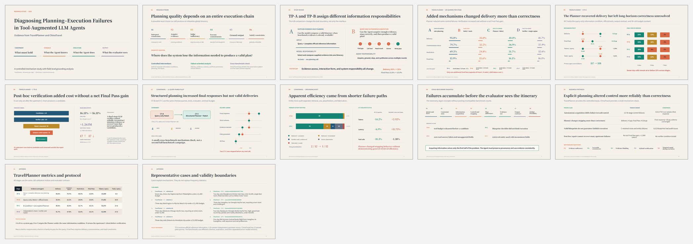

# Diagnosing Planning–Execution Failures in Tool-Augmented LLM Agents

*Evidence from TravelPlanner and ChinaTravel*

This project studies where tool-augmented LLM agents fail in long-horizon,
multi-constraint planning. Travel planning is used as an experimental testbed,
not as the end application: the central question is whether explicit planning
and verification mechanisms actually repair failures in information
acquisition, execution control, grounding, and global constraint satisfaction.



## Study design

The TravelPlanner study uses four frozen conditions on the same 180 validation
queries:

| Condition | Evidence and agent responsibility | Main purpose |
|---|---|---|
| TP-A | Query + supplied official reference information; one-shot itinerary generation | Measure sole-planning with evidence already supplied |
| TP-B | Query-only ReAct with official tools | Observe the full acquisition, stopping, grounding, and planning system gap |
| TP-C | TP-B + one explicit global Planner | Test the Planner under the same information condition |
| TP-D | Independent TP-C-chain + post-hoc Verifier and at most one Replan | Test whether final-stage repair recovers candidate-level failures |

TP-A to TP-B is a **sole-planning to tool-mediated system gap**, not a
tool-only causal ablation: evidence access, system responsibility, and
interaction form all change.

ChinaTravel is a small cross-benchmark mechanism check, not a second full
benchmark campaign. It compares query-only ReAct (CT-B) with Structured Planner
+ ReAct (CT-C) on the same 12 Chinese queries.

## Headline findings

- Autonomous evidence acquisition introduced substantial agent-control and
  non-delivery failures beyond plan generation.
- Explicit planning changed stopping and delivery behavior more consistently
  than end-to-end correctness.
- A schema-valid blueprint did not guarantee grounded or faithful execution.
- Post-hoc LLM verification added considerable cost without a net Final Pass
  improvement in this implementation.
- The ChinaTravel audit showed that apparent efficiency gains were largely
  driven by premature stopping rather than reliably better retrieval.

These are mechanism-level observations under the documented protocols, not
claims that tools, planners, or verifiers are universally ineffective.

## Key results

### TravelPlanner — 180 queries per condition

| Condition | Delivery | Final Pass | Tokens/query | Tools/query |
|---|---:|---:|---:|---:|
| TP-A | 95.0% | 13.89% | 10.9k | 0.00 |
| TP-B | 35.0% | 15.56% | 57.6k | 19.43 |
| TP-C | 40.0% | 16.11% | 56.0k | 17.83 |
| TP-D | 41.67% | 16.11% | 63.0k | 17.58 |

### ChinaTravel — 12-query paired pilot

| Metric | CT-B | CT-C |
|---|---:|---:|
| Final response | 33.3% | 58.3% |
| Strict schema delivery | 33.3% | 33.3% |
| Fully grounded itinerary | 2/12 | 1/12 |
| All Pass | 0/12 | 0/12 |

Because ChinaTravel contains only 12 paired pilot queries, its results are used
for qualitative pattern comparison and failure diagnosis rather than
benchmark-wide ranking.

## Repository guide

- [`research/research_narrative.md`](research/research_narrative.md): complete research story.
- [`research/results_master.json`](research/results_master.json): source of reported numbers.
- [`research/frozen_claims.md`](research/frozen_claims.md): claims and wording boundaries.
- [`research/challenge_to_rq.md`](research/challenge_to_rq.md): literature-to-evidence-to-RQ matrix.
- [`research/unified_failure_taxonomy.md`](research/unified_failure_taxonomy.md): eight-layer failure taxonomy.
- [`research/representative_cases.md`](research/representative_cases.md): eight diagnostic case cards.
- [`research/validity_boundaries.md`](research/validity_boundaries.md): interpretation limits.
- [`deck/Diagnosing_Planning_Execution_Failures.pptx`](deck/Diagnosing_Planning_Execution_Failures.pptx): editable research deck.
- [`references/references.bib`](references/references.bib): verified bibliography.

## Reproducibility boundary

This repository is a compact research package. It does not redistribute the
benchmarks' databases or the large raw run directories. The machine-readable
results retain numerators, denominators, metric definitions, and source-field
provenance. The original experiment suites remain frozen and were not rerun to
prepare this repository.

Run the self-contained package checks with:

```bash
python scripts/validate_public_package.py
```

For benchmark data, tools, and evaluator definitions, see the official
TravelPlanner and ChinaTravel projects cited in
[`references/references.bib`](references/references.bib).
